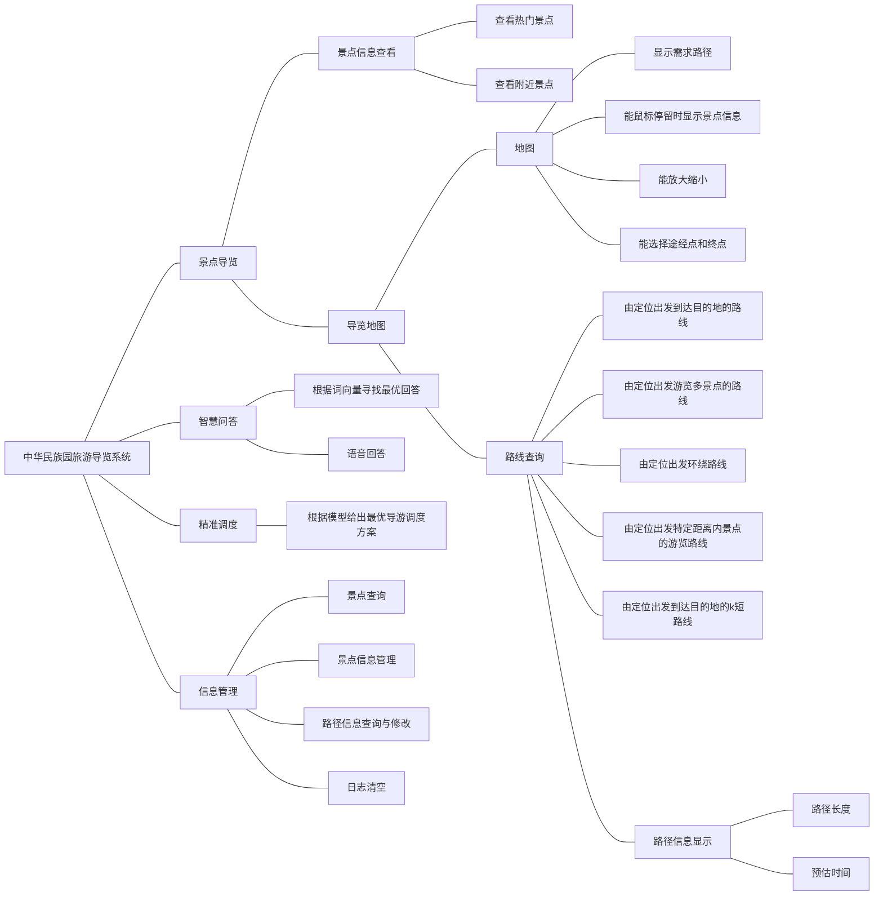

# 中华民族园旅游导览系统

[](https://www.cau.edu.cn)    [](https://www.python.org/)    [](https://pypi.org/project/PyQt5/)                    [](http://pyecharts.org/)    

[TOC]

<撰稿人：贾云嵩>


## 运行须知

请按照标题下方python包版本安装对应的package，使用本软件根目录下 \_\_main\_\_.py 运行。


## 总体介绍

* 简述：依托智慧旅游概念，给游客提供更好的游玩体验，实现景区信息的透明化。
* 受众：游客及景区工作人员。
* 功能：对景区地图的导览和相关路线的规划，及对系统的更新与维护。


## 设计人员及其涉及的模块设计

* 苏晗宇：SightseeingManager.py、智能问答页面模块编写、智能问答和精准调度和信息管理页面UI设计
* 李一鸣：GraphManager.py、FAQRobot.py、精准调度页面UI设计
* 李中昊：GraphManager.py、主窗口及景点导览页面UI设计
* 贾云嵩：QueryLogManager.py、SightseeingManager.py、GraphEdges.py、FAQRobot.py及界面的设计与响应编写


## 功能结构



## 文件结构

  ```perl
中华民族园旅游导览系统 v1.0 正式版
├── __main__.py		# 主运行
├── Entrance.py		# 软件运行入口
├── README.md       # 软件介绍指南
├── 中华民族园旅游导览系统项目控制文档.md       # 介绍本次设计项目运作
│
├── DataSource		# 数据管理模块
│   ├── __init__.py			# 包引用管理
│   ├── FAQsys				# 智能问答模块
│   │   ├── __init__.py				# 包引用管理
│   │   ├── A.txt					# 回答信息数据
│   │   ├── Q.txt					# 问题信息数据
│   │   └── FAQRobot.py				# 智能问答类
│   │
│   ├── Graph				# 路径信息管理模块
│   │   ├── __init__.py				# 包引用管理
│   │   ├── Graph.csv				# 路径信息数据
│   │   └── GraphManager.py			# 路径管理类
│   │
│   ├── QueryLog			# 日志信息管理模块
│   │   ├── __init__.py				# 包引用管理
│   │   ├── queryLog.history		# 日志信息数据
│   │   └── QueryLogManager.py		# 日志管理类
│   │
│   └── Sightseeing			# 景点信息管理模块
│       ├── __init__.py				# 包引用管理
│       ├── Sightseeing.csv			# 景点信息数据
│       ├── SightseeingManager.py	# 景点管理类
│       └── images					# 景点及相关显示图片文件夹
│           └── *.jpg/*.png					# 图片
│
├── LoadWindow		# 加载界面模块
│   ├── __init__.py			# 包引用管理
│   ├── Class.py			# 功能与UI窗口链接类，同时连接请求信号传递信息
│   └── Resources			# 界面资源文件夹
│   	└── Foreground.jpg			# 背景图片
│
└── MainWindow		# 主窗口模块
    ├── __init__.py			# 包引用管理
    ├── Class.py			# UI功能类，链接响应，优化线程调度
    ├── UI					# UI设计模块
    │   ├── __init__.py				# 包引用管理
    │   ├── window.py				# Qt Designer 设计修改后界面类
    │   └── Resources				# 图形界面所需的资源文件夹
    │       └── Background.jpg				# 背景图片
    │
    └── ChildWindows		# 子窗口及嵌套窗口文件夹
        ├── __init__.py				# 包引用管理
        ├── Set.py					# 父子窗口间响应链接函数
        ├── ManagerPage				# 信息管理页面模块
        │   ├── __init__.py			# 包引用管理
        │   ├── Class.py			# UI功能类，链接响应，优化线程调度
        │   └── UI					# UI设计模块
        │       ├── __init__.py				# 包引用管理
        │       └── window.py				# Qt5 界面类
        │
        ├── PathGuidePage			# 景点导览页面模块
        │   ├── __init__.py			# 包引用管理
        │   ├── Class.py			# UI功能类，链接响应，优化线程调度
        │   └── UI					# UI设计模块
        │       ├── __init__.py				# 包引用管理
        │       └── window.py				# Qt5 界面类
        │
        ├── RobotWindow				# 智能问答页面模块
        │   ├── __init__.py			# 包引用管理
        │   ├── Class.py			# UI功能类，链接响应，优化线程调度
        │   └── UI					# UI设计模块
        │       ├── __init__.py				# 包引用管理
        │       ├── window.py				# Qt5 界面类
        │       ├── chat_message.py			# UI对话框绘制类
        │   	└── asset					# 头像资源文件夹
        │   	    ├── left_head.png				# 导游头像
        │   	    └── right_head.png				# 游客头像
        │
        └── SchedulingPage			# 精准调度页面模块
            ├── __init__.py			# 包引用管理
            ├── Class.py			# UI功能类，链接响应，优化线程调度
            ├── Function			# 功能函数文件夹
            │   ├── __init__.py				# 包引用管理
            │   └── IntelligentScheduling.py		# 建模计算函数
            │
            └── UI					# UI设计模块
                ├── __init__.py				# 包引用管理
                └── window.py				# Qt5 界面类
  ```


## 功能模块

### 日志管理类

```python
class QueryLogManager:
    """
    Features
    -----------------------------------------
    日志管理类，用于记录添加和推荐查询，可自动重构、存储日志，利用list、dict可变数据类型特性进行构建操作

    Members
    ----------------------------------------
    __queryLogPath : <str> 日志文件目录
    __LogNum : <dict> 日志记录数量字典，用于控制日志更新周期，结构：{出发地编号: 总查询请求次数, ...}
    __QueryLog : <dict> 日志记录字典，结构：{出发地编号: [[目的地编号, 查询请求次数], ...], ...}
    __OldLog : <dict> 上一更新周期的日志记录字典，结构：{出发地编号: [[目的地编号, 查询请求次数], ...], ...}
    __MaxHeap : <dict> 大根堆，用于查询热点景点，结构：{出发地编号: [QueryLog[出发地编号]的大根堆], ...}

    Functions
    ----------------------------------------
    __init__(filepath: str, placeNum: int = 23) : 新建类并加载历史记录
    addQueryLog(nowPlace: int, vertexSet: list) : 添加查询记录
    clearAll() : 删除所有查询记录
    SearchRecommendAttraction(self, curvertex: int) -> List[List[int]] : 利用历史数据更新查询当前顶点的推荐景点

    """
```

### 景点信息管理类

```python
class AttractionInfo(object):
    """
    Features
    -----------------------------------------
    景点信息类

    Member
    -----------------------------------------
    num : <int> 编号
    name : <str> 景点名称
    x : <int> x
    y : <int> y
    miniIntro: <str> 简介
    intro : <str> 介绍
    active : <list> 活动

    """

class AttractionSet(object):
    """
    Features
    -----------------------------------------
    景点管理类

    Members
    ----------------------------------------
    attractions : <dict> 景点字典
    __graph : <dict> 路径图

    Functions
    ----------------------------------------
    __init__(self, path: str, graph) : 新建类并加载景点信息文件
    SearchAttractionsImage(num) : 获取景区图片路径
    SearchAttractionsImgFile(name) : 获取景区图片路径
    __addAttractionsFromFile(self, path: str) : 加载文件数据
    searchAttractionsInfoByName(self, name: str) : 根据景点名称查询景点信息(可使用编辑距离等算法以支持模糊查询)
    searchAttractionsInfo(self, id: int) : 根据景点编号查询景点信息
    updateAttractionsInfoFromList(self, id: int, mesList: list, operateType: int = 0) : 使用list景点信息的更新、添加、删除，默认做删除操作
    updateAttractionsInfo(self, id: int, attrInfo: AttractionInfo = None, operateType: int = 0) : 景点信息的更新、添加、删除，默认做删除操作

    """
```

### 路径图管理类

```python
class GraphEdges(object):
    """
    Features
    -----------------------------------------
    稀疏图类

    Members
    ----------------------------------------
    __size: <int> 图的顶点个数
    __cnt: <int> 图的边的个数
    __edges: <list> 存储边的信息，每一个元素是一个四元组(起点，终点，边长，下一条边的索引)
    __head: <list> 每个顶点的初始边(类似于邻接表的头节点)
    __ver2idx: <dict> 两端点到其所对应边的映射

    Functions
    ----------------------------------------
    __init__(size, path, logFunc) : 新建类并加载历史记录
    __updateRealDis() : 利用floyd算法建立实际距离图
    queryEdgeByTwoVertexes(i, j) : 根据路径两端点的景点编号 i,j 查询路径信息
    queryWeightByTwoVertexes(i, j) : 根据路径两端点的景点编号 i,j 查询路径初始权重
    queryDisByTwoVertexes(i, j) : 根据路径两端点的景点编号 i,j 查询两点间实际距离
    queryEdgesByVertex(idx) : 根据景点编号 idx 查询与该景点邻接的边的信息
    addOrDelVertex(idx: int, isAdd: bool = True) : 根据景点编号删除相关景点
    updatePathInfo(vertexPair, newWeight) : 路径信息的更新，默认做删除操作
    searchHamilton(startVertex, vertexSet,endVertex, isCircut) : 根据顶点集的大小不同，选择不同算法求解最短哈密顿回路
    searchPathByDijkstra(startVertex, endVertex) : 根据起点startVertex与终点endVertex搜索最短路径
    getAllPaths(startVertex, endVertex, path) : 求两点之间适宜距离内的所有路径
    searchKShortestPath(startVertex, endVertex, k) : 求两点之间的k短路
    SearchWithinDistance(self, curvertex: int, distance: int) : 求在当前景点一定距离内的景点(广度优先搜索算法，及时剪枝)
    """
```

### 智能问答类

```python
class FAQRobot:
    """
    Features
    -----------------------------------------
    智能问答机器人

    Functions
    ----------------------------------------
    __init__(self, qtxtPath, atxtPath) : 新建类并加载问答资源
    FAQAnswer(self, query) : 问答
    
    """
```


## 重要算法说明

图的存储

> 适用场景：普适
>
> 具体算法及数据结构：对于**稀疏图**，使用**链式前向星**存储；对于**稠密图**，采用**邻接矩阵**存储

两点间最短距离

> 适用场景：游客想要知道从景点A到景点B的最短路径怎么走
>
> 具体算法及数据结构：对于**稀疏图**，使用**(是否带优化随意)SPFA算法**；对于**稠密图**，使用**堆优化的Dijkstra算法**。

哈密顿回路

> 适用场景：导游宣布一段时间后在A地集合，游客想从A地出发，经过景点集$V$中的景点后回到A点，求整个回路的最短路径怎么走
>
> 具体算法及数据结构：对于$|V|\leq 15$的图，使用**状态压缩的动态规划算法**；对于$|V|>15$的图，使用**智能算法(模拟退火或蚁群算法)或近似算法(优化后的贪心算法)**。

哈密顿通路

> 适用场景：游客当前位于A地，想要知道经过景点集$V$中的景点后到达B地(通常是出口)，求整个哈密顿通路的最短路径怎么走
>
> 具体算法及数据结构：同上

景点推荐(基于**个人喜好**)

> 适用场景：游客游玩A地之后想知道还有哪些景点适合自己
>
> 具体算法及数据结构：将该问题建模成“**啤酒尿布**”问题，使用**Apriori算法或FP-growth算法**关联分析用户历史数据的两种查询：**1.对第一种查询(两点间最短距离)，每次保存二元组(A,B) 2.对于第二种查询(哈密顿回路)，每次保存n元组(A,$V$)**。

景点推荐(基于**近邻策略**)

> 适用场景：游客游玩A地之后想知道附近还有哪些景点
>
> 具体算法及数据结构：可使用**Floyd算法**更新距离，求出距当前点一定距离内的所有顶点编号

语音问答

> 适用场景：根据游客提问返回特定回答
>
> 具体算法及数据结构：自然语言处理

导游调度

> 适用场景：根据当前场景数据给出最优调度策略
>
> 具体算法及数据结构：排队论


