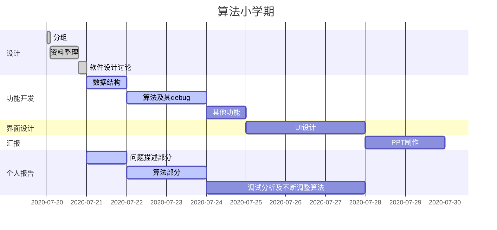

# :national_park:   ​中华民族园旅游导览系统

[](https://www.cau.edu.cn)     [](https://www.python.org/)    [](https://pypi.org/project/PyQt5/)                  [](http://pyecharts.org/)    

[TOC]

<Author: 贾云嵩>


## :date:  ​阶段安排

### 要求

1. DAY 1       同学自行结组，并进行选题，务必明确团队的各成员分工
2. DAY 2-5    完成项目的需求分析、设计、代码编写和测试等环节
3. DAY 6-8    项目相关文档资料的撰写
4. DAY 9-10  答辩，提交文档，小组互评


### 安排




#### 设计阶段 - 07.20

##### 准备 - 07.20 10:30

* 苏晗宇——地图，转化成图结构
* 李中昊——景点资料整理
* 贾云嵩——总结软件所有功能
* 李一鸣——通过功能总结本次算法


##### 功能实现分工 - 07.20 19:30

###### 讨论列表

* 记录怎么写

  > 做了什么简单总结一下就行

* 敲定数据结构

  > * 使用numpy / pandas进nha行读取与操作
  > * 在系统启动和关闭时记得更新存储的数据

* 算法各自的分工（DDL：7.23 晚）

  > * 苏晗宇——景点查询、修改+路径修改+哈密顿回路的动态规划
  > * 李中昊——建图+SPFA(对SPFA不熟悉用Dijkstra也可)+floyd
  > * 贾云嵩——基于个人喜好的景点推荐
  > * 李一鸣——数据结构+蚁群或模拟退火算法

* 代码书写形式

  ```python
  # package版本参照标题下
  import ...
  
  # 已经提及的函数和类名称依据文档里的命名
  class ...
  	'''
  	类文档注释
  	'''
  
  def ...
  	'''
  	函数文档注释
  	'''
  
  if __name__ == '__main__':
      ...
      # 测试代码
  ```


#### 界面实现分工 - 07.23 19:30

###### 讨论列表

* 有关算法实现功能的讨论

  > * 苏晗宇
  >
  >   * 景点信息管理
  >   * 哈密顿回路的动态规划
  >   * 路径修改
  >
  > * 李一鸣
  >
  >   * 路径图数据结构
  >   * 扩展功能
  >
  > * 李中昊
  >
  >   * Dijkstra算法
  >   * Floyd算法
  >
  > * 贾云嵩
  >
  >   * ##### 日志存储、地点推荐
  >
  >     * 修正原因：用历史数据进行景点推荐那一块我觉得用Apriori算法或FP-Growth算法不太OK，因为我们数据都是有向的，前面二者都只能找非有向数据的关联度/置信度（也可能是我bzd），而且当数据新增和更新日志之后需要重新查一遍。
  >       我找了一些资料，在景点这方面的统计一般是**频度统计**，所以我就改成依据频度统计的推荐了。其他还有基于时间和GPS定位计算停留时间（这个我们没有数据，用不了），还有使用MCMC（但这个计算的是最终停留点，觉得大概率会推荐必经之处比如出口，而非所以没有用）进行推荐的。到最后我就改成了用同一始发点中地点的频度计算了景点推荐。
  >
  >     * 结构：序列表、指针树（大根堆），通过序列表完成频度更新，仅调节指针完成排序
  >
  >     * 算法：大根堆构架、单节点更新
  >
  >     * 需要预设值：地点数、日志路径
  >
  >       ```python
  >       class QueryLogManager:
  >           """
  >           Features
  >           -----------------------------------------
  >           日志管理类，用于记录添加和推荐查询，可自动重构、存储日志，利用list、dict可变数据类型特性进行构建操作
  >       
  >           Members
  >           ----------------------------------------
  >           __queryLogPath : <str> 日志文件目录
  >           __LogNum : <dict> 日志记录数量字典，用于控制日志更新周期，结构：{出发地编号: 总查询请求次数, ...}
  >           __QueryLog : <dict> 日志记录字典，结构：{出发地编号: [[目的地编号, 查询请求次数], ...], ...}
  >           __OldLog : <dict> 上一更新周期的日志记录字典，结构：{出发地编号: [[目的地编号, 查询请求次数], ...], ...}
  >           __MaxHeap : <dict> 大根堆，用于查询热点景点，结构：{出发地编号: [QueryLog[出发地编号]的大根堆], ...}
  >       
  >           Functions
  >           ----------------------------------------
  >           __init__(filepath: str, placeNum: int = 23) : 新建类并加载历史记录
  >           addQueryLog(nowPlace: int, vertexSet: list) : 添加查询记录
  >           clearAll() : 删除所有查询记录
  >           SearchRecommendAttraction(self, curvertex: int) -> List[List[int]] : 利用历史数据查询当前点的推荐景点
  >       
  >           """
  >       ```
  >
  >   * ##### 一定范围内景点查询
  >
  >     * 算法：BFS
  >
  >     * 需要获取的其他数据：邻接节点及距离的获取函数
  >
  >       ```python
  >       def SearchWithinDistance(queryEdgesByVertex, curvertex: int, distance: int) -> List[Tuple[int, int]]:
  >           """
  >           求在当前景点一定距离内的景点(广度优先搜索算法，及时剪枝)
  >       
  >           :param queryEdgesByVertex: <def> 邻接节点及距离的获取函数
  >           :param curvertex: <int> 当前所在地景点编号
  >           :param distance: <int> 距离阈值
  >           :return: <list> 距离当前顶点距离在阈值内的景点编号及长度
  >           """
  >       ```

* 整合时需要调整的地方

  > 无

* 工具原料

  ```python
  pip install PyQt5 -i https://pypi.tuna.tsinghua.edu.cn/simple
  pip install PyQt5-tools -i https://pypi.tuna.tsinghua.edu.cn/simple
  pip install pyecharts
  
  # 扩展工具配置
  https://www.cnblogs.com/feigen/p/11082745.html
  ```

* UI界面样式及元件功能讨论

  > * 元件
  >   * 大窗口窗口序列——功能类进入
  >   * 地图
  >   * ......——输入输出操作

* 窗口功能响应、所需函数、层次结构

  > * 景点概览
  >   * 主要控件
  >     * 地图
  >       * 地图缩放
  >       * 景点详细信息（鼠标停留）
  > * 路径规划
  >   * 主要控件
  >     * 地图
  >       * （鼠标悬停显示概述）
  >       * （鼠标点击选择景点）
  >   * 主要算法函数、类
  >     * 路径规划函数
  >   * 功能
  >     * 按照所选目的地规划路径
  >     * 景点推荐
  > * 智能问答
  >   * 主要算法
  >     * 问答知识库（自然语言处理）
  > * 后台管理
  >   * 景点信息管理
  >   * 路径信息管理
  
* 整体文件结构规划

  ```perl
  ├── 
  │   ├── 
  │   └── 
  └── 
  
  # 示例结构 —— 仅供参考，贾云嵩软著申请中，除了小学期课设外不便公开
  # 具体结构可参见 Greenhouse_Event_Tracking_Software 初版
  # 如下描述仅就通用结构而言，实现时会根据实际情况进行简化，使用时请注明结构制作者
  
  Greenhouse_Event_Tracking_Software
  ├── Running.pyw		# 软件运行入口
  ├── LICENSE			# 著作说明
  ├── README.md       # 软件介绍指南
  │
  ├── LoadWindow		# 加载界面文件夹
  │   ├── __init__.py			# 包引用管理
  │   ├── Class.py			# 功能与UI窗口链接类，同时连接请求信号传递信息
  │   └── Resources			# 界面资源文件夹
  │   	└── Foreground.jpg			# 背景图片
  │
  ├── MainWindow		# 主窗口文件夹
  │   ├── __init__.py			# 包引用管理
  │   ├── Class.py			# 功能与UI窗口链接类与通用后台线程类，同时连接请求信号传递信息，实现界面控制
  │   ├── Config.yaml			# 预设配置
  │   ├── UI					# UI设计文件夹
  │   │   ├── __init__.py				# 包引用管理
  │   │   ├── window(图形界面).ui		 # Qt Designer 设计的界面文件
  │   │   ├── window.py				# window(图形界面).ui 导出的部分修改后界面类
  │   │   ├── EchartsMaker.py			# pyecharts 显示类
  │   │   ├── OtherUIFunc...
  │   │   └── Resources				# 图形界面所需的资源文件夹
  │   │       ├── echarts_js					# pyecharts js 依赖文件夹
  │   │       │   └── echarts.min.js			# pyecharts js 依赖
  │   │       └── OtherResources...
  │   │
  │   ├── Function			# 功能函数文件夹
  │   │   ├── __init__.py				# 包引用管理
  │   │   └── Functions...				# 各种功能函数的 python 文件
  │   │
  │   └── ChildWindows		# 子窗口及嵌套窗口文件夹
  │       ├── __init__.py				# 包引用管理
  │       ├── Set.py					# 窗口响应链接函数
  │       ├── ChildWindow_1			# 第一个子窗口文件夹
  │       │   └── ...		# 与 MainWindow 结构相同
  │       │
  │       └── ChildWindow_n			# 第 n 个子窗口文件夹
  │           └── ...		# 与 MainWindow 结构相同
  │
  └── DataBase		# 数据管理文件夹
      ├── __init__.py			# 包引用管理		
      ├── DataBaseManager.py	# 数据管理类
      └── Data.accdb			# 数据文件
  ```

* 整理好自己的算法后，进行具体分工安排

  * 苏晗宇 —— UI 界面设计
  * 李一鸣 —— 可视化设计
  * 贾云嵩 —— Class.py 设计
  * 李中昊 —— 数据管理类 设计


##### 分工调整 - 07.24

* 苏晗宇 —— 部分 UI 界面设计、部分页面编写及算法优化
* 李一鸣 —— 算法优化、新算法研究及新功能添加
* 贾云嵩 —— 所有UI 响应、软件结构、数据功能类及可视化设计
* 李中昊 —— 部分 UI 界面设计、算法优化

< 于7.28结束 >


#### 报告完善 07.28 10:00

##### 分工安排

* 苏晗宇 —— PPT设计
* 李一鸣 —— 课设报告书写
* 贾云嵩 —— UI 响应优化及部分报告书写
* 李中昊 —— 报告书写及调试分析


## :ballot_box_with_check:  ​预设

* 只考虑南园
* 路径使用折线显示，不考虑具体形状
* 使用csv保存信息
* 使用稀疏图记录图结构


## :book:  ​参考资料

<由李一鸣提供>

### 链接资料

* [dijkstra详解](https://mp.weixin.qq.com/s?__biz=MzUyOTg0NzQxMA==&mid=2247483853&idx=5&sn=c2b0e5ee792f43fa71faa8d3915ba790&chksm=fa5b84d0cd2c0dc62b5d686ccded02bfc9e81167c6f4b839280a2bc4dab13becb78ce78a8233&mpshare=1&scene=24&srcid=0720aD5AqcHQ4W2RknpSjT3U&sharer_sharetime=1595247778473&sharer_shareid=170ea8fe7585a1c9d4203899a6933b5a&key=4598b5ee8f6c4950bf20f352d1f4d1cfcea1d5c051cc05f8c70c6611d808fccec54768e47fede1b8bee60a8d1b7754a6d18eba1e674303a8228b4c3ecdd1604202aee012a1b856e845631987ba78f9f4&ascene=1&uin=ODAzMDAzODg4&devicetype=Windows+10+x64&version=6209007b&lang=zh_CN&exportkey=A3EnBgKx2wuo73zrJh5GQNo%3D&pass_ticket=Iy5iiVzRX%2FQHU45uUvW%2F2cEvh%2Bq%2BakdXOhldLPG%2BsKhk6FOcXgQQGy8qUmPXE6KQ)
* [SPFA算法教学](https://mp.weixin.qq.com/s?__biz=MzUyOTg0NzQxMA==&mid=2247483745&idx=6&sn=f48a2fc9cd5fcdf6953eb5eabbf37771&chksm=fa5b847ccd2c0d6aaa36490f20edfafb6ed89948be44c8355c12d07d0d923b4a4aed3a063910&mpshare=1&scene=24&srcid=0720BLNAT1ka9FV9nW6Y15Sn&sharer_sharetime=1595247747117&sharer_shareid=170ea8fe7585a1c9d4203899a6933b5a&key=7adf10a6617c63158e070947605b3939ea68ca4116abc424500008f21facb480a94151ab35f33d98e8ce66d9e0c8e2f29ad2f33deb594593a73d1643a44f2a72d99a9c6ea77e743878e557a65a162518&ascene=1&uin=ODAzMDAzODg4&devicetype=Windows+10+x64&version=6209007b&lang=zh_CN&exportkey=A47mnAsYbzzM9fzAl6BDoDE%3D&pass_ticket=Iy5iiVzRX%2FQHU45uUvW%2F2cEvh%2Bq%2BakdXOhldLPG%2BsKhk6FOcXgQQGy8qUmPXE6KQ)
* [浅谈玄学算法——模拟退火](https://www.luogu.com.cn/blog/m-sea/qian-tan-SA)
* [SPFA算法的玄学方法](https://www.luogu.com.cn/blog/xhhkwy/spfa-hacker-orzorz)
* [学图论，你真的了解最短路吗？](https://www.luogu.com.cn/blog/FrozaFerrari/xue-tu-lun-ni-zhen-di-liao-xie-zui-duan-lu-ma-post)
* [python机器学习案例系列——关联分析（Apriori、FP-growth）](https://zhuanlan.zhihu.com/p/106461867?utm_source=wechat_session&utm_medium=social&utm_oi=988773113613664256)
* [干货 十分钟教你用动态规划算法解Travelling Salesman Problem（TSP）问题](https://zhuanlan.zhihu.com/p/45882410?utm_source=wechat_session&utm_medium=social&utm_oi=988773113613664256)
* [链式前向星讲解](https://blog.csdn.net/sugarbliss/article/details/86495945)

### 代码资料

#### Dijkstra算法

```c++
#include <iostream>
#include <cstdio>
#include <queue>
#include <algorithm>
#define FOR(i,a,b) for(int i = a; i < b; i++)
using namespace std;
typedef pair<int,int> PII;
const int INF = 0x3f3f3f3f;
const int N = 2000+10;
int m,n,cnt;
int head[N>>1],dis[N>>1];
bool vis[N>>1];
typedef struct edge
{
	int u,v,w;
	int next;
}edge;
edge edges[N<<1];
void add(int u,int v,int w)
{
	edges[++cnt].u = u;
	edges[cnt].v = v;
	edges[cnt].w = w;
	edges[cnt].next = head[u];
	head[u] = cnt;
}
void dijkstra()
{
	priority_queue<PII> pq;
	dis[n] = 0;
	pq.push(make_pair(dis[n],n));
	while(! pq.empty())
	{
		int tmp = pq.top().second;
		vis[tmp] = true;
		pq.pop();
		for(int i = head[tmp];i != 0;i = edges[i].next)
		{
			int v = edges[i].v,w = edges[i].w;
			if(dis[v] > dis[tmp] + w && !vis[v])
			{
				dis[v] = dis[tmp] + w;
				pq.push(make_pair(-dis[v],v));
			}
		}
	}
	return;
}
int main(void)
{
	cin>>m>>n;
	while(m--)
	{
		int u,v,w;
		scanf("%d %d %d",&u,&v,&w);
		add(u,v,w);
		add(v,u,w);
	}
	FOR(i,1,n+1)
		dis[i] = INF;
	dijkstra();
	cout<<dis[1]<<endl;
}

```

#### 哈密顿回路 动态规划

```c++
1.  #include<bits/stdc++.h>  
2.	using namespace std;  
3.	#define FOR(i,a,b) for(int i = a; i < b; i++)   
4.	const int INF = 0x3f3f3f3f;  
5.	int s;  
6.	int N;  
7.	int init_point;  
8.	double **dp;   
9.	double **dis;   
10.	double ans;  
11.	  
12.	void readData()  
13.	{   
14.	    scanf("%d", &N);  
15.	    dis = new double*[N];  
16.	    FOR(i,0,N)  
17.	    {  
18.	        dis[i] = new double[N];  
19.	        FOR(j,0,N)  
20.	            scanf("%lf", &dis[i][j]);  
21.	    }  
22.	    return;  
23.	}  
24.	  
25.	void init()  
26.	{   
27.	    dp = new double*[(1 << N)];  
28.	    FOR(i,0,(1<<N))  
29.	    {  
30.	        dp[i] = new double[N];  
31.	        FOR(j,0,N)  
32.	            dp[i][j] = INF;   
33.	    }  
34.	    ans = INF;  
35.	    return;  
36.	}  
37.	double solve()  
38.	{  
39.	    int M = (1 << N);   
40.	    dp[1][0] = 0;   
41.	    FOR(i,1,M)  
42.	    {  
43.	        if (!(i & 1))   
44.	            continue;  
45.	        FOR(j,1,N)  
46.	        {   
47.	            if (i & (1 << j))  
48.	                continue;   
49.	            FOR(k,0,N)  
50.	                if (i & (1 << k))   
51.	                    dp[(1 << j) | i][j] = min(dp[(1 << j) | i][j], dp[i][k] + dis[k][j]);  
52.	        }  
53.	    }      
54.	    FOR(i,0,N)  
55.	        ans = min(dp[M - 1][i] + dis[i][0], ans);  
56.	    return ans;  
57.	}  
58.	  
59.	int main(){  
60.	    readData();  
61.	    init();  
62.	    double ans = solve();  
63.	    cout<<ans;  
64.	    delete[] dp;  
65.	    delete[] dis;  
66.	    return 0;  
67.	}  

```

